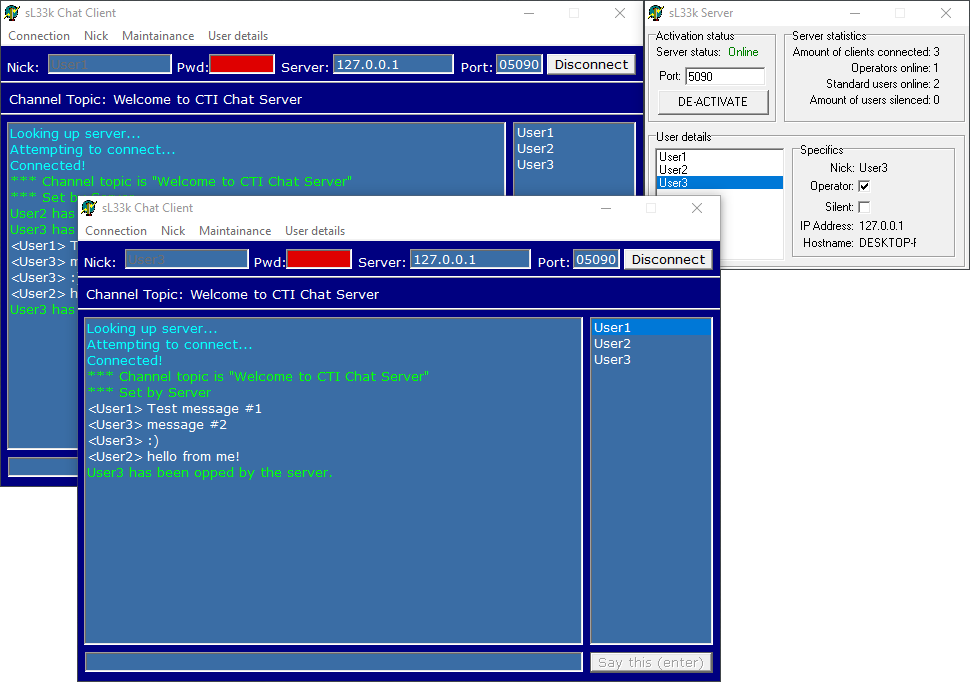

# CTI/sL33k Chat (client & server)

### About:
A client + server chat application

### Instructions:
Run the "Server/Project1.exe" and click "ACTIVATE", then run "Client/Project1.exe" and enter a Nick(name) and click "Connect".

### Screenshot:

### Info:
**Created:** 2001

**Operating System:** Windows 2000 or newer

**Compile with:** Borland Delphi 6, or Borland Delphi 7 (but then go to "Component" -> "Install Packages" -> "Add", and select "C:\Program Files\Borland\Delphi7\Bin\dclsocket70.bpl" to enable Socket components)
